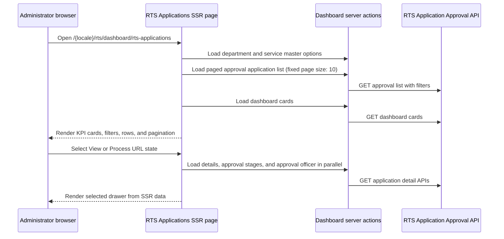

# RTS Administrator Dashboard and Document Workflow

## Purpose

This reference describes the administrator/officer RTS application dashboard in the normal authenticated portal. It is intended for backend discussion and specifically documents application drawers and protected document view/download behavior.

This flow is different from the citizen portal under `/[locale]/service`. Citizen pages use `rts_session` and citizen profile cookies. The administrator RTS dashboard is a normal protected application route and follows the standard access-token/refresh-token authentication workflow.

## Scope

| Component or route | Responsibility |
| --- | --- |
| `src/app/[locale]/rts/dashboard/rts-applications/page.tsx` | Server-side loads application list, filter options, KPI cards, and selected drawer data. |
| `src/app/[locale]/rts/dashboard/rts-applications/actions.ts` | Server actions for SSR list/detail loading and approval decisions. |
| `src/components/modules/rts/dashboard/RtsApplicationDashboard.tsx` | Dashboard filters, pagination, table, URL navigation, and drawer selection. |
| `src/components/modules/rts/dashboard/RtsApplicationDrawerContext.tsx` | Read-only application View drawer. Exported component is `RtsApplicationViewDrawer`. |
| `src/components/modules/rts/dashboard/RtsApplicationProcessDrawer.tsx` | Officer Process drawer: fields, documents, stages, remarks, and permitted decisions. |
| `src/components/modules/rts/dashboard/RtsApplicationDocumentView.tsx` | Full document-preview drawer. |
| `src/lib/api/rts/rtsdocument.service.ts` | RTS server-side document upload/view/download API wrapper. |
| `src/app/api/rts/documents/[guid]/[action]/route.ts` | Authenticated Next.js proxy that streams document view/download responses. |

## Authentication Boundary

### Administrator RTS dashboard

The normal middleware branch protects `/[locale]/rts/...` through the standard auth cookies and token validity logic:

- `auth_token`
- `refresh_token`
- session-expiry state and related normal application cookies

The backend-facing server calls use `apiClient` or authenticated server fetches, so backend authorization is expected to identify the signed-in officer through this normal token/session context.

### Citizen portal is separate

The citizen portal under `/[locale]/service` uses a separate `rts_session` cookie and a cookie-backed citizen profile. It must not be assumed to have the normal `auth_token` used by this dashboard.

## SSR Dashboard Flow



### List filters and pagination

The application dashboard uses URL-driven SSR state. It resolves the following filters before calling the approval-list API:

- `department=<department-slug>`
- `service=<service-slug>`
- `status=<submitted|pending|approved|rejected|reverted>`
- `search=<application-number>`
- `pageNumber=<positive integer>`
- `pageSize=10`

Department and service slugs are resolved server-side against the department/service master APIs. The list request sends numeric IDs only after resolution. The service enforces `PageSize=10` regardless of URL input.

## Drawer Route State

The dashboard uses mutually exclusive drawer routes to avoid overlapping drawers:

| URL query | Rendered drawer | Required validation |
| --- | --- | --- |
| `view=<applicationId>` | `RtsApplicationViewDrawer` | ID must be a positive ID on the current loaded grid page. |
| `process=<applicationId>-<stage-name-slug>` | `RtsApplicationProcessDrawer` | Application must be on the current grid page and the stage slug must match the current officer stage. |
| `doc=<documentGuid>` | `RtsApplicationDocumentView` | Dashboard renders the document drawer from the GUID route state. |

When opening Process, the dashboard stores the View URL in session storage and changes the route to the standalone `process` parameter. Process close returns to the stored View route. Document close uses `router.back()` so it returns to the preceding View or Process route when opened through dashboard navigation.

## Application View Drawer

`RtsApplicationDrawerContext.tsx` renders an administrator-facing application summary from SSR-provided `RtsApplicationProcessData`.

It displays:

- Application number, citizen name, submitted date, SLA, and application status.
- Approval stages from the approval-stages API.
- Submitted document metadata from the application details API.
- View/Download controls only when a document is uploaded and has a `documentGuid`.
- A route transition to Process for the current approval stage.

The View drawer does not fetch its own approval data after mount. Its detail, stage, and officer data are loaded by the page/server action before rendering.

## Application Process Drawer

`RtsApplicationProcessDrawer.tsx` is the officer processing workspace. It receives the same SSR-loaded process data and renders individual section errors without hiding successful sections.

### Server-loaded data

The server action `getRtsApplicationProcessDataAction(applicationId)` calls the three approval APIs in parallel:

| Data | Used for |
| --- | --- |
| Application details | Complete dynamic form field groups and document metadata. |
| Approval stages | Shared `ApprovalStagesTimeline` state and historical remarks. |
| Approval officer | Current stage title, officer context, SLA/status, and `can*` permission flags. |

### Process UI and action permissions

The process drawer supports:

- Document carousel/list, with View and Download for uploaded documents.
- Approval stage timeline.
- Officer remark input.
- Read-only application fields, with Edit available only when `canEdit` is true.
- Expand All / Collapse All for field groups.
- Permission-driven footer buttons.

The visible footer actions are determined by the approval-officer response flags:

- `canVerifyDocument`
- `canApprove`
- `canReject`
- `canReturn`
- `canPay`
- `canViewNoteSheet`

Implemented decision calls include document verification, sending for approval, rejection, and verify-and-correct field updates. Action requests include the current officer remark and resolve `updatedBy` from the normal authenticated user cookie context. After a successful action, the dashboard refreshes its current SSR route.

## RTS Document API Integration

### Service wrapper

`src/lib/api/rts/rtsdocument.service.ts` is the RTS document wrapper. It exposes:

| Function | Backend API | Function behavior |
| --- | --- | --- |
| `uploadRtsDocument` | `POST /documents/upload` | Uploads document multipart data. Used by citizen service-form submission before application creation. |
| `viewAdminRtsDocument(documentGuid)` | `GET /documents/{documentGuid}/view` | Requests an administrator-authenticated stream for inline preview. |
| `downloadAdminRtsDocument(documentGuid)` | `GET /documents/{documentGuid}/download` | Requests an administrator-authenticated attachment stream for download. |

For view/download, `apiClient` supplies the normal authenticated backend context. This is appropriate for the administrator dashboard because it operates under the standard auth workflow.

### Authenticated RTS proxy

The route handler below is the intended protected browser-facing proxy:

```text
GET /api/rts/documents/{documentGuid}/view
GET /api/rts/documents/{documentGuid}/download
```

Implementation: `src/app/api/rts/documents/[guid]/[action]/route.ts`.

The proxy:

1. Allows only `view` and `download` actions.
2. Calls `viewAdminRtsDocument` or `downloadAdminRtsDocument` server-side.
3. Preserves backend `Content-Type`, `Content-Disposition`, and `Content-Length` headers when present.
4. Streams the backend response body to the browser.
5. Uses `Cache-Control: private, no-store` and `X-Content-Type-Options: nosniff`.
6. Returns sanitized `400`, backend-status, or `502` failures without exposing credentials.

### Current dashboard URL behavior

`RtsApplicationDashboard.tsx` uses `getAdminRtsDocumentViewUrl` and `getAdminRtsDocumentDownloadUrl` from `src/lib/api/rts/rtsdocument.client.ts`. Those helpers call the authenticated internal RTS document proxy:

```text
/api/rts/documents/{guid}/view
/api/rts/documents/{guid}/download
```

`RtsApplicationDocumentView.tsx` opens the view URL in an iframe and uses the download URL from its footer button. The Process drawer opens the document drawer through the `doc` route parameter.

The dashboard does not navigate directly to the backend document URL. This keeps the normal administrator token server-side while the Next.js proxy streams the document response.

### Document state rules

The drawers rely on the application-details API document data:

- `documentName`
- `documentGuid`
- `isRequired`
- `isUploaded`

View and Download are enabled only when `isUploaded` is true and `documentGuid` is present. Required-but-not-uploaded documents remain visible as missing and cannot be opened.

## Backend Questions

1. Should the administrator dashboard use the existing RTS Next.js document proxy for all iframe view/download traffic, or are direct authenticated backend URLs the official contract?
2. If direct URLs are supported, what mechanism carries the administrator authorization in browser navigation and iframe requests?
3. Confirm document-view response headers for images, PDFs, Office documents, and unknown file types, especially `Content-Type` and `Content-Disposition`.
4. Confirm whether `documentGuid` is sufficient for authorization or whether the backend must validate the current application/department/officer relationship before streaming.
5. Confirm the success/error envelope and authorization behavior for the approval detail, stage, officer, verify, approve, reject, and verify-and-correct APIs used by the Process drawer.
6. Confirm whether `canReturn`, `canPay`, and `canViewNoteSheet` will receive their own decision/read APIs; the UI may display these actions based on permission flags.

## Related Code

- `src/middleware.ts`
- `src/app/[locale]/rts/dashboard/rts-applications/page.tsx`
- `src/app/[locale]/rts/dashboard/rts-applications/actions.ts`
- `src/components/modules/rts/dashboard/RtsApplicationDashboard.tsx`
- `src/components/modules/rts/dashboard/RtsApplicationDrawerContext.tsx`
- `src/components/modules/rts/dashboard/RtsApplicationProcessDrawer.tsx`
- `src/components/modules/rts/dashboard/RtsApplicationDocumentView.tsx`
- `src/components/common/ApprovalStagesTimeline.tsx`
- `src/lib/api/rts/rts-application-approval.service.ts`
- `src/lib/api/rts/rtsdocument.service.ts`
- `src/lib/api/rts/rtsdocument.client.ts`
- `src/app/api/rts/documents/[guid]/[action]/route.ts`
