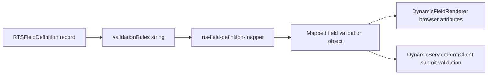

# Dynamic RTS Field Validation Contract

This document describes how the citizen dynamic-service form reads `RTSFieldDefinition.validationRules` and applies validation in the UI. It is intended for backend and database developers who configure RTS service fields.

## Scope

The dynamic form receives active `RTSFieldDefinition` records for a service, maps each record to a browser field, and validates it in two places:

1. The browser control receives applicable HTML attributes such as `min`, `max`, `maxLength`, `pattern`, and `accept`.
2. `DynamicServiceFormClient` validates again before a section is considered complete or an application is submitted.

Validation is client-side assistance only. The backend must validate the same rules before accepting an application.

## Processing Flow



Primary implementation files:

- `src/lib/utils/rts/rts-field-definition-mapper.ts`: parses and maps API/DB values.
- `src/components/modules/rts/forms/DynamicFieldRenderer.tsx`: applies input constraints while rendering.
- `src/components/modules/rts/forms/DynamicServiceFormClient.tsx`: sanitizes values and validates on submit.

## Required Database Columns

| Column | Purpose | Notes |
| --- | --- | --- |
| `fieldType` | Selects the input/control type. | See supported types below. Unknown values render as text. |
| `isRequired` | Makes a field mandatory. | This is the required-field source for JSON configurations. |
| `validationRules` | Optional JSON rule object. | Preferred format for every new field definition. |
| `minValue`, `maxValue`, `maxLength` | Optional DB-column fallbacks. | Used when their equivalent JSON keys are absent. |
| `optionsJson` | Options for select, radio, and checkbox fields. | Must be a JSON array. |
| `isActive` | Controls whether the field renders. | Inactive fields are omitted from the form. |

## Preferred `validationRules` Format

Store a single valid JSON object. Do not wrap it in Markdown or add comments.

```json
{
  "pattern": "^[0-9]{10}$",
  "exactLength": 10,
  "allow": "numeric",
  "inputMode": "numeric",
  "message": "Enter a valid 10-digit number."
}
```

If the JSON contains regular-expression backslashes, escape them for JSON. For example, use `"^\\d{6}$"` in the stored JSON string.

### Supported JSON Keys

| Key | Value type | Applied to | Behavior |
| --- | --- | --- | --- |
| `pattern` | string | Text-like, select, radio values | Full JavaScript regular expression checked during form validation. Also passed to compatible browser inputs. |
| `minLength` | number | Text-like values | Rejects shorter values on validation. |
| `maxLength` | number | Text-like values | Limits typing and rejects longer values. |
| `exactLength` | number | Text-like values | Limits typing and requires exactly this many characters. |
| `min` | number | `number`, `decimal`, `amount`, `year` | Minimum numeric value. |
| `max` | number | `number`, `decimal`, `amount`, `year` | Maximum numeric value. |
| `minDate` | string | `date`, `datetime`, `month` | Minimum allowed date-like value. See date formats below. |
| `maxDate` | string | `date`, `datetime`, `month` | Maximum allowed date-like value. See date formats below. |
| `minTime` | string | `time` | Minimum time, normally `HH:mm`. |
| `maxTime` | string | `time` | Maximum time, normally `HH:mm`. |
| `allow` | string | Text-like, select values | Filters invalid characters while the user types. |
| `inputMode` | string | Text-like inputs | Browser keyboard hint: `text`, `numeric`, `decimal`, `tel`, `search`, `email`, or `url`. |
| `normalize` | string or string array | Text-like values | Applies `trim`, `uppercase`, `removeSpaces`, and/or `removeCommas`. |
| `acceptedFormats` | string array or string | `file` | Allowed file extensions, without the leading dot. |
| `accept` | string | `file` | Browser file-picker filter, for example `".pdf,.jpg,.png"` or `"image/*"`. |
| `maxFileSizeMb` | number | `file` | Maximum file size in megabytes. |
| `message` | string | All supported validation failures | Custom validation error message. |

### Supported Key Aliases

The mapper also accepts these aliases for deployment compatibility. New records should use the primary names above.

| Primary key | Accepted aliases |
| --- | --- |
| `min` | `minValue` |
| `max` | `maxValue` |
| `minDate` | `dateMin`, `min_date` |
| `maxDate` | `dateMax`, `max_date` |
| `minTime` | `timeMin`, `min_time` |
| `maxTime` | `timeMax`, `max_time` |
| `minLength` | `minlength`, `min_length` |
| `maxLength` | `maxlength`, `max_length` |
| `exactLength` | `exactlength`, `length` |
| `inputMode` | `input_mode` |
| `normalize` | `normalise` |
| `acceptedFormats` | `fileTypes`, `fileType`, `allowedTypes`, `allowedExtensions`, `extensions`, `file` |
| `maxFileSizeMb` | `maxSizeMb`, `maxSize`, `maxsize` |
| `message` | `errorMessage` |

`maxsize` may also be a string such as `"5 MB"`.

## Field Type Matrix

| API `fieldType` | Rendered control | Recommended keys | Notes |
| --- | --- | --- | --- |
| `text` | text input | `pattern`, lengths, `allow`, `normalize` | General text control. |
| `email` | email input | Optional `pattern`, `allow`, `inputMode: "email"` | Defaults to a valid address ending in `@gmail.com` when no pattern is configured. |
| `mobile`, `tel`, `phone` | telephone input | Optional overrides: `pattern`, lengths, `allow` | Default Indian mobile validation is applied if absent. |
| `number`, `decimal`, `amount` | number input | `min`, `max`, `allow: "decimal"`, `inputMode: "decimal"` | Use `allow: "decimal"` for decimal values. |
| `year` | number input | `min`, `max` | Numeric-only input behavior is applied automatically. |
| `date` | date input | `minDate`, `maxDate` | Use `YYYY-MM-DD`, `today`, or `yesterday`. |
| `datetime`, `date_time`, `date-time` | datetime-local input | `minDate`, `maxDate` | Use `YYYY-MM-DDTHH:mm`; do not use symbolic dates. |
| `month` | month input | `minDate`, `maxDate` | Use `YYYY-MM`; do not use symbolic dates. |
| `time` | time input | `minTime`, `maxTime` | Use `HH:mm` in 24-hour format. |
| `url`, `password` | matching browser input | `pattern`, lengths | Add explicit DB rules where required. |
| `textarea` | textarea | lengths, `pattern`, `allow`, `normalize` | `maxLength` is applied to the textarea. |
| `select`, `dropdown`, `radio` | choice control | `pattern` if needed | `isRequired` verifies a selection. Options come from `optionsJson`. |
| `checkbox` | single or multi-choice checkbox | `isRequired` | Required means checked/at least one selected. Other scalar rules are not applied. |
| `file`, `upload` | file picker | `acceptedFormats`, `accept`, `maxFileSizeMb` | Validation occurs for selected `File` values. |
| `hidden`, `label` | non-standard/display field | none | Do not use for user-entered validation. |

## Date Rules

For a `date` field, explicit values must be ISO dates:

```json
{
  "minDate": "1900-01-01",
  "maxDate": "today"
}
```

`today` and `yesterday` are special case-insensitive tokens. The frontend resolves them using the browser's local calendar date before applying native input constraints and submit validation.

| Stored value | Example resolved value on 2026-08-17 | Use |
| --- | --- | --- |
| `"1900-01-01"` | `1900-01-01` | Passed through unchanged. |
| `"today"` | `2026-08-17` | Current local date. |
| `"yesterday"` | `2026-08-16` | Previous local date. |

Use symbolic tokens only for `fieldType: "date"`. `datetime-local` requires `YYYY-MM-DDTHH:mm`, and `month` requires `YYYY-MM`.

## File Rules

Recommended file validation:

```json
{
  "acceptedFormats": ["pdf", "jpg", "jpeg", "png"],
  "maxFileSizeMb": 5,
  "message": "Upload a PDF or image smaller than 5 MB."
}
```

`acceptedFormats` is the actual extension validation. `accept` only affects the browser file-picker filter and should not be used alone.

```json
{
  "accept": ".pdf,.jpg,.jpeg,.png",
  "maxFileSizeMb": 5
}
```

## Examples by Use Case

### Required name

Set `isRequired` to `true`.

```json
{
  "pattern": "^[A-Za-z\\p{L}\\p{M}\\s.]{2,50}$",
  "minLength": 2,
  "maxLength": 50,
  "allow": "letters",
  "normalize": ["trim"],
  "message": "Enter a valid name."
}
```

### Standard Indian mobile number

`fieldType` should be `mobile`, `tel`, or `phone`.

```json
{
  "pattern": "^[7-9][0-9]{9}$",
  "exactLength": 10,
  "allow": "numeric",
  "inputMode": "numeric",
  "message": "Enter a valid 10-digit mobile number starting with 7, 8, or 9."
}
```

If no JSON rule is supplied for a telephone field, the frontend applies the same 7-9, 10-digit default.

### Gmail email address

For `fieldType: "email"`, the frontend defaults to this pattern when no explicit `pattern` is configured:

```text
^[A-Za-z0-9._%+-]+@gmail\\.com$
```

Provide `pattern` in `validationRules` when the service must allow a different domain or a broader email format. An explicit pattern always overrides the Gmail default.

### Numeric range

```json
{
  "min": 1900,
  "max": 2100,
  "allow": "numeric",
  "inputMode": "numeric"
}
```

### Decimal amount

```json
{
  "min": 0,
  "max": 1000000,
  "allow": "decimal",
  "inputMode": "decimal",
  "message": "Enter a valid amount."
}
```

### PIN code

```json
{
  "pattern": "^[0-9]{6}$",
  "exactLength": 6,
  "allow": "numeric",
  "inputMode": "numeric"
}
```

### Time range

```json
{
  "minTime": "09:00",
  "maxTime": "17:30"
}
```

## Input Sanitization Rules

`allow` changes what can remain in the field while typing:

| `allow` value | Result |
| --- | --- |
| `numeric` or `digits` | Keeps ASCII digits only. |
| `decimal` | Keeps digits and one decimal point. |
| `letters` | Keeps Unicode letters, marks, and spaces. |
| `alpha` | Keeps Unicode letters, marks, spaces, apostrophes, hyphens, and dots. |
| `alphanumeric` | Keeps ASCII letters and digits. |
| Regex or character class | Keeps matches from the provided expression. |

Use `pattern` for final format validation. Use `allow` only when removing disallowed characters during entry is desirable.

`normalize` may be a string or an array:

```json
{
  "normalize": ["trim", "uppercase", "removeSpaces"]
}
```

Supported values are `trim`, `uppercase`, `removeSpaces`, and `removeCommas`.

## Precedence and Fallbacks

For a rule represented in both places, values have this precedence:

1. JSON `validationRules` value.
2. Dedicated database column, where supported (`maxLength`, `minValue`, `maxValue`).
3. Legacy rule-string value, only when `validationRules` is not valid JSON.
4. Type default for mobile/tel/phone fields.

The mobile default is `^[7-9][0-9]{9}$`, exact length 10, max length 10, numeric-only input, and numeric input mode. A JSON rule can override these defaults.

## Legacy Rule Strings

The mapper still reads older pipe/comma/semicolon-style rule strings, for example:

```text
required|maxLength:10|pattern:^[0-9]{10}$
```

or:

```text
minDate:1900-01-01|maxDate:today
```

This format is retained for old records only. New database records must use JSON because JSON safely supports arrays, custom messages, file rules, and escaped regex values.

For JSON records, set `isRequired: true`; do not rely on `{"required": true}` because `required` is not a supported JSON validation key.

## Keys Not Currently Read From `validationRules` JSON

Do not store these expecting behavior from the dynamic database form:

| Key | Reason |
| --- | --- |
| `required` | Use the database `isRequired` column instead. |
| `validationKey` | Registry-based validation is code configuration, not mapped from the API field definition. |
| `customValidate` | Custom validators are code-only and are not parsed from database JSON. |
| Conditional visibility/disable rules | These are form-code features and are not mapped from `validationRules`. |

## Configuration Checklist

1. Use a supported `fieldType`.
2. Set `isRequired` for mandatory input.
3. Store valid JSON in `validationRules` for new definitions.
4. Use ISO values for date/time constraints.
5. Use `today` or `yesterday` only on `date` fields.
6. Provide `acceptedFormats` and `maxFileSizeMb` for file fields.
7. Provide `optionsJson` for choice fields.
8. Test the field in the citizen service form and enforce the same validation server-side.
